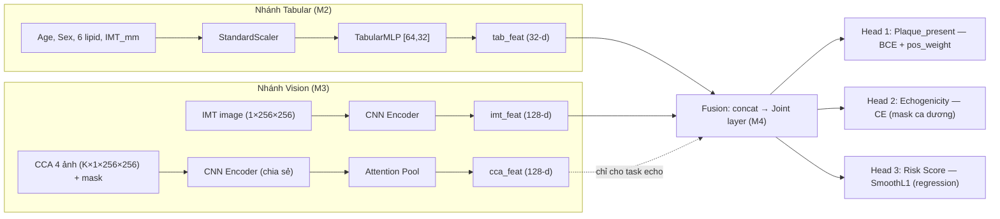

# KẾ HOẠCH DỰ ÁN — Mô hình Đa phương thức Chẩn đoán & Phân tầng Nguy cơ Xơ vữa Động mạch cảnh

**Dự án:** Master-UIT-MedSignal · **Nhóm:** 5 thành viên (M1–M5) · **Thời gian:** 3 tuần · **Dataset:** `clinical_carotid_dataset_v3`

---

## 0. Thực tế dữ liệu (ĐÃ KHẢO SÁT & XÁC MINH — không suy đoán)

> Trước khi lập kế hoạch, toàn bộ dataset đã được đọc và đếm trực tiếp. Một số con số **khác** giả định ban đầu — kế hoạch dưới đây bám theo **số liệu thật**.

| Hạng mục | Thực tế đã verify | Hệ quả thiết kế |
|---|---|---|
| Tổng số ca | 300 (P001–P300), 15 cột CSV | — |
| `Plaque_present` | **0: 205 ca · 1: 95 ca** (≈32% dương, lệch về Control) | Bài toán **mất cân bằng** → class weight + `StratifiedKFold` + **PR-AUC** |
| `Plaque_echogenicity` | None=205, Intermediate=40, Low=28, High=27 | 3 lớp thật (Low/Int/High) chỉ trên ca dương; "None" = ignore |
| `Baseline_Risk_Category` | **Low=293, Moderate=7** (suy biến) | **KHÔNG** phân loại; chuyển sang **hồi quy `Baseline_Risk_Score`** (liên tục) |
| Lp(a) ↔ Echogenicity | echo **Low** có Lp(a) cao nhất (mean 42.0) > Int (34.4) > High (28.4) | Quan hệ **nghịch** — phù hợp y học (mảng *echolucent*/giàu lipid nguy hiểm hơn). Báo cáo đúng chiều. |
| Nhóm Discordance (LDL<130 & Lp(a)≥50) | **18 ca, trong đó 6 dương** | n nhỏ → **case study định tính**, ghi rõ giới hạn thống kê, không suy diễn quá mức |
| Ảnh | 680 PNG, 256×256, grayscale 8-bit (<1KB/ảnh) | ảnh hình học giả lập → CNN nhỏ, train từ đầu |
| Phân bố ảnh | Control: **1 ảnh IMT/ca** · Target: **5 ảnh** (IMT + CCA_L1/L2/R1/R2) | xem cảnh báo leakage bên dưới |

### ⚠️ Cảnh báo Leakage quan trọng nhất của dự án
Mỗi Control có **đúng 1 ảnh**, mỗi Target có **đúng 5 ảnh** → **số lượng ảnh = nhãn plaque hoàn hảo**. Nếu nhánh Vision gộp ảnh kiểu Multi-Instance đơn thuần, model sẽ "đếm ảnh" và đạt accuracy giả ~100% mà không học gì về bệnh lý.

**Nguyên tắc bắt buộc cho cả nhóm:**
- Nhánh Vision dự đoán `Plaque_present` **chỉ dùng ảnh `*_IMT.png`** (mọi ca đều có đúng 1 — công bằng).
- 4 ảnh `*_CCA_*.png` (chỉ ca dương có) **chỉ phục vụ task `Plaque_echogenicity`** (vốn chỉ định nghĩa trên ca dương).
- Không đưa "số lượng ảnh / có hay không CCA" vào bất kỳ feature nào của task plaque.

---

## PHẦN 1 — PHÂN VAI 5 THÀNH VIÊN (Roles & Task Allocation)

Mỗi người **một mảng chính**, hỗ trợ một mảng phụ; ghép code qua **data-contract** thống nhất (mục Phần 3).

### M1 — Data Engineering & Pipeline *(phụ: hỗ trợ M3 về ảnh)*
- Đọc & làm sạch `carotid_clinical_dataset_300cases.csv`; encode `Sex` (Male→1/Female→0); chuẩn hoá 8 đặc trưng số bằng `StandardScaler` **fit trên train fold** (tránh rò rỉ).
- Phân tích `Associated_Images` → đường dẫn ảnh IMT (mọi ca) và danh sách CCA (ca dương).
- Viết `CarotidDataset` (PyTorch) + `collate_fn` xử lý **1 ảnh vs 5 ảnh** (pad CCA về K=4 + mask).
- Viết `StratifiedKFold(5)` theo `Plaque_present`, lồng cân bằng tỉ lệ echogenicity trong nhóm dương.
- **Chốt & công bố data-contract** (dict batch) cho M2/M3/M4.

### M2 — Tabular Branch + ML Baselines *(phụ: hỗ trợ M5 về SHAP)*
- `TabularMLP`: 9 feature (8 số + Sex) → `[64, 32]` → vector 32-d (Dropout + Weight Decay).
- Baseline ML truyền thống: **XGBoost / LightGBM** cho `Plaque_present` (mốc so sánh "không deep learning").
- Baseline hồi quy `Baseline_Risk_Score` (MLP + GBM).
- Đặc biệt: baseline **"LDL-C only"** và **"lipid panel"** để làm đối chứng cho phân tích discordance (Phần 4).

### M3 — Vision Branch (CNN Classifiers) *(phụ: hỗ trợ M4 về feature ảnh)*
- `ImageEncoder`: ResNet-18 sửa cho **1 kênh** (grayscale) hoặc Custom CNN nhẹ; train từ đầu + **augmentation mạnh** (flip, rotate, jitter) + Dropout để chống overfit (dữ liệu nhỏ).
- Nhánh IMT → đặc trưng `imt_feat` cho task plaque.
- Nhánh CCA: encode 4 ảnh → **Attention Pooling** (gated attention, Ilse 2018) → `cca_feat`, **chỉ dùng cho head echogenicity**. Pooling phải xử lý mask (ca Control K=0).

### M4 — Multimodal Fusion & Multi-task Joint Training *(phụ: hỗ trợ M2 ráp tabular)*
- Kiến trúc **Mid/Late Fusion**: `concat(tab_feat, imt_feat)` (+ tuỳ chọn `cca_feat`) → lớp joint → 3 head.
- 3 head: (1) `Plaque_present` — BCE (có `pos_weight`); (2) `Plaque_echogenicity` — CrossEntropy **mask về ca dương** (`ignore_index`); (3) `Baseline_Risk_Score` — `SmoothL1`/MSE.
- **Multi-task loss** = Σ wᵢ·Lossᵢ; bắt đầu trọng số cố định (config), nâng cấp **uncertainty weighting** (Kendall 2018) nếu còn thời gian.
- Vòng train chung (mixed-precision trên Colab GPU), early stopping theo val PR-AUC.

### M5 — Evaluation, Explainability & Demo *(phụ: tổng hợp báo cáo)*
- Metrics y tế: **Sensitivity, Specificity, F1, AUC-ROC, PR-AUC** (5-fold, mean±std); Macro-F1 cho echo; MAE/R² cho risk.
- Phân tích **discordance** (n=18/6 dương) — trung thực, kèm cảnh báo n nhỏ; bổ trợ: AUC phân tầng theo dải Lp(a) liên tục.
- **Grad-CAM** (ảnh IMT/CCA) + **SHAP** (tabular) để giải thích.
- **Demo Streamlit**: nhập chỉ số + upload ảnh → hiển thị xác suất plaque, echogenicity, risk score + heatmap.

---

## PHẦN 2 — LỘ TRÌNH 3 TUẦN (Week-by-Week Roadmap)

### 🟢 Tuần 1 — Nền tảng & Baseline đơn phương thức
| TV | Công việc |
|---|---|
| M1 | Pipeline CSV (clean/encode/scale) + `StratifiedKFold` + `CarotidDataset`/`collate_fn` chạy smoke test; **công bố data-contract** |
| M2 | `TabularMLP` + XGBoost/LightGBM baseline `Plaque_present` (ra AUC/F1 trên 5-fold) |
| M3 | `ImageEncoder` + IMT-CNN baseline plaque + augmentation pipeline |
| M4 | Chốt interface fusion & chữ ký module (khớp data-contract của M1) |
| M5 | `metrics.py` (sens/spec/f1/auc/pr-auc) + khung bảng báo cáo & notebook eval |

**📦 Deliverable cuối T1:** loader thống nhất + 2 baseline (tabular, vision) ra số trên 5-fold; mọi module import được, không lỗi ghép nối.

### 🟡 Tuần 2 — Fusion & Multi-task
| TV | Công việc |
|---|---|
| M1 | Tối ưu loader: `WeightedRandomSampler` cân bằng lớp; kiểm thử cạnh (ca Control K=0) |
| M2 | Hoàn thiện hồi quy `Baseline_Risk_Score` + baseline "LDL-only"/"lipid panel" |
| M3 | Attention pooling CCA → `cca_feat` cho head echogenicity |
| M4 | Ráp `MultimodalFusion` + 3 head + multi-task loss; train end-to-end |
| M5 | Pipeline đánh giá đa nhiệm + log per-fold cho cả 3 task |

**📦 Deliverable cuối T2:** model multimodal train end-to-end trên Colab GPU, log đủ 3 task trên 5-fold.

### 🔴 Tuần 3 — Đánh giá, Giải thích, Demo & Báo cáo
| TV | Công việc |
|---|---|
| M4 | Tinh chỉnh trọng số loss (hoặc uncertainty weighting), chốt model tốt nhất |
| M5 | Bảng **ablation** (Tabular/Vision/Multimodal) + Grad-CAM + SHAP + **Streamlit demo** |
| M2 | Phân tích discordance & đối chứng LDL-only vs Multimodal |
| M1–M3 | Hỗ trợ sửa lỗi, freeze code, viết phần kỹ thuật báo cáo |

**📦 Deliverable cuối T3:** báo cáo hoàn chỉnh + bảng so sánh + demo chạy được + slide.

---

## PHẦN 3 — KIẾN TRÚC KỸ THUẬT (Technical Architecture)

### 3.1 Sơ đồ luồng dữ liệu



### 3.2 Cơ chế gộp ảnh (Image Aggregation) — CHỐT cho M1/M3/M4

| Trường hợp | Số ảnh | Xử lý |
|---|---|---|
| **Control** (Plaque=0) | 1 (IMT) | `imt_img` dùng cho fusion+plaque; `cca` rỗng → `cca_mask` toàn 0 → `cca_feat = 0` (không ảnh hưởng head plaque) |
| **Target** (Plaque=1) | 5 (IMT + 4 CCA) | `imt_img` cho plaque; 4 CCA → encoder → **attention pool (theo mask)** → `cca_feat` cho head echo |

- **IMT luôn đúng 1 ảnh** → `imt_feat` cố định, **không cần pad**.
- **CCA biến thiên K∈{0,4}** → trong batch pad về K=4 kèm `cca_mask` (1=ảnh thật, 0=pad); attention pooling nhân mask trước softmax → ca Control không đóng góp.
- Nhờ tách IMT (plaque) khỏi CCA (echo) → model **không** đoán plaque dựa trên "có/không có CCA" ⇒ chống leakage.

### 3.3 Data-contract (dict mỗi sample do M1 cung cấp)
```python
{
  "patient_id": str,                  # "P003"
  "tabular":   FloatTensor[9],        # 8 số đã scale + Sex
  "imt_img":   FloatTensor[1,256,256],# luôn có
  "cca_imgs":  FloatTensor[K,1,256,256], # K=0 (Control) hoặc 4 (Target)
  "labels": {
    "plaque": FloatTensor[1],         # 0./1.
    "echo":   LongTensor[1],          # 0/1/2 (Low/Int/High) hoặc -100 (ignore nếu Control)
    "risk":   FloatTensor[1],         # Baseline_Risk_Score
  }
}
# collate_fn -> pad cca_imgs về K=4 trong batch + tạo cca_mask BoolTensor[B,4].
```

---

## PHẦN 4 — KẾ HOẠCH ĐÁNH GIÁ & ABLATION

### 4.1 Bảng so sánh chính (5-fold, mean ± std)

| Mô hình | Plaque: Sens / Spec / F1 / AUC-ROC / PR-AUC | Echo (Macro-F1) | Risk (MAE / R²) |
|---|---|---|---|
| Tabular — MLP | | – | ✓ |
| Tabular — XGBoost/LightGBM | | – | ✓ |
| Vision — IMT-CNN | | – | – |
| **Multimodal Fusion** | | ✓ | ✓ |

**Kỳ vọng:** Multimodal ≥ tốt nhất trong các baseline đơn phương thức về PR-AUC/Sensitivity. Báo cáo % cải thiện kèm độ lệch chuẩn.

### 4.2 Phân tích Discordance (mục tiêu y khoa cốt lõi)
- **Định nghĩa (giữ nguyên):** LDL-C < 130 mg/dL **và** Lp(a) ≥ 50 mg/dL → **18 ca (6 dương)**.
- So sánh **Sensitivity/Recall** của baseline **"LDL-only"** vs **Multimodal** trên đúng nhóm này.
- ⚠️ **Trung thực:** n=18 quá nhỏ để kết luận thống kê chắc chắn → trình bày dưới dạng **case study định tính**, liệt kê từng ca, ghi rõ giới hạn.
- **Bổ trợ (toàn 300 ca):** AUC/Sensitivity phân tầng theo dải `Lp(a)` liên tục để minh hoạ giá trị của thông tin Lp(a) vượt LDL-C mà không phụ thuộc cỡ mẫu subgroup.

### 4.3 Chỉ số bắt buộc
- **Sensitivity** (độ nhạy — ưu tiên cao trong sàng lọc), **Specificity**, **F1-Score**, **AUC-ROC**.
- Thêm **PR-AUC** (do lệch lớp 32% dương) và báo cáo **mean ± std** qua 5 fold.

---

## Phụ lục — Ràng buộc kỹ thuật (chống ảo tưởng công nghệ)
1. **Không Segmentation** (U-Net/SAM): dataset không có mask → Vision chỉ làm Classification.
2. **Không model khổng lồ**: ưu tiên ResNet-18/MobileNetV3/Custom CNN nhỏ + regularization mạnh (Dropout, Weight Decay, Augmentation) vì chỉ 300 ca.
3. **Xử lý số ảnh không đồng nhất** bằng attention pooling + mask (mục 3.2), **không** để rò rỉ số lượng ảnh.
4. **Khai thác Discordance** đúng mức — coi là điểm nhấn y khoa nhưng báo cáo trung thực do cỡ mẫu nhỏ.
