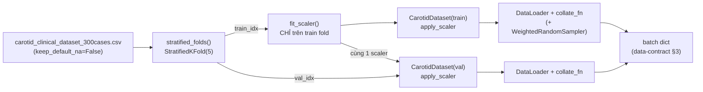

# 📦 M1 — Data Pipeline & Data-Contract

> **Tài liệu tích hợp cho M2 (Tabular), M3 (Vision), M4 (Fusion).**
> Đây là *hợp đồng dữ liệu* (data-contract) chính thức của dự án. Mọi nhánh model **bám theo cấu trúc dict** mô tả ở đây để ghép nối không xung đột.

Module `src/data/` chịu trách nhiệm: đọc & làm sạch CSV → chia fold chống rò rỉ → chuẩn hóa → đóng gói thành `torch` batch sẵn sàng cho training. Đã có **test suite tự động** (`tests/test_data_pipeline.py`, 29 test, 100% pass) bảo chứng tính đúng đắn.

---

## 1. Luồng xử lý (Data Flow)



**Nguyên tắc chống rò rỉ (đã enforce + test):**
1. `StandardScaler` **fit trên train fold**, *apply* cho cả train/val của fold đó. `CarotidDataset` **chỉ apply, không bao giờ fit** (test `test_dataset_never_fits_scaler`).
2. Ảnh **IMT** dùng cho task `Plaque_present`; 4 ảnh **CCA** *chỉ* cho task `Plaque_echogenicity`. Không đưa "số lượng ảnh" thành feature của task plaque.
3. Nhãn `Plaque_echogenicity` của ca âm = `-100` → bị `CrossEntropyLoss(ignore_index=-100)` bỏ qua.

### ▶️ Chạy thử toàn pipeline bằng 1 lệnh

Để kiểm chứng cả 3 mảnh (preprocess → splits → dataset) chạy thông và xem data-contract in ra trực tiếp:

```bash
python -m src.data.run_pipeline                          # chạy 4 bước, in từng bước
python -m src.data.run_pipeline --sampler --scan-images  # + cân bằng lớp + quét 680 ảnh
python -m src.data.run_pipeline --fold 2 --batch-size 32 # đổi fold / batch
```

File [run_pipeline.py](run_pipeline.py) là điểm vào đầu-cuối của M1: in tóm tắt làm sạch, bảng cân bằng 5 fold, một batch mẫu (kèm shape/dtype), và tự kiểm tra `cca_mask` khớp nhãn plaque (chống leakage).

---

## 2. Data-Contract — 1 sample (`CarotidDataset.__getitem__`)

| Key | Kiểu / Shape | Dtype | Range / Giá trị | Ý nghĩa |
|---|---|---|---|---|
| `patient_id` | `str` | — | `"P001"`… | Mã bệnh nhân |
| `tabular` | `Tensor[9]` | `float32` | đã chuẩn hóa (Sex giữ 0/1) | 8 đặc trưng số (đã scale) + `Sex` |
| `imt_img` | `Tensor[1,256,256]` | `float32` | `[0,1]` | Ảnh IMT (mọi ca đều có **đúng 1**) |
| `cca_imgs` | `Tensor[K,1,256,256]` | `float32` | `[0,1]` | `K=0` (Control) hoặc `K=4` (Target) |
| `labels.plaque` | `Tensor[1]` | `float32` | `0.` / `1.` | Có mảng xơ vữa |
| `labels.echo` | `Tensor[1]` | `int64` | `0/1/2` hoặc `-100` | Low/Intermediate/High; `-100`=ignore (ca âm) |
| `labels.risk` | `Tensor[1]` | `float32` | liên tục ~`[0,1]` | `Baseline_Risk_Score` (hồi quy) |

> **Thứ tự cột `tabular`** = `cfg["columns"]["numeric"]` (8 cột) + `cfg["columns"]["categorical"]` (Sex). Lấy chính xác bằng `preprocess.feature_columns(cfg)` — **đừng hard-code**.

## 3. Data-Contract — 1 batch (sau `collate_fn`)

| Key | Shape | Dtype | Ghi chú |
|---|---|---|---|
| `patient_id` | `list[str]` (len `B`) | — | |
| `tabular` | `[B,9]` | `float32` | |
| `imt_img` | `[B,1,256,256]` | `float32` | stack thẳng |
| `cca_imgs` | `[B,4,1,256,256]` | `float32` | **pad về K=4**, phần thừa = 0 |
| `cca_mask` | `[B,4]` | `bool` | `True`=ảnh thật, `False`=pad/Control |
| `labels.plaque` | `[B,1]` | `float32` | |
| `labels.echo` | `[B,1]` | `int64` | |
| `labels.risk` | `[B,1]` | `float32` | |

**Quy ước mask cho M3/M4 (quan trọng):**
- Control (Plaque=0): `cca_mask[i]` = `[F,F,F,F]`, `cca_imgs[i]` = toàn `0`. → Attention pooling phải nhân mask trước softmax ⇒ `cca_feat = 0`, **không** ảnh hưởng head plaque.
- Target (Plaque=1): `cca_mask[i]` = `[T,T,T,T]`.

---

## 4. Quick Start — vòng lặp 5-fold chuẩn (cho M4)

```python
import torch
from torch.utils.data import DataLoader
from src.data import preprocess as P
from src.data.dataset import CarotidDataset, collate_fn, make_weighted_sampler
from src.data.splits import stratified_folds, fold_summary

cfg = P.load_config("configs/config.yaml")
df  = P.load_dataframe(cfg)                 # 300 ca; "None" giữ nguyên là chuỗi
folds = stratified_folds(df, cfg)           # list[(train_idx, val_idx)] × 5
print(fold_summary(df, folds, cfg))         # kiểm tra cân bằng từng fold

for fold, (tr_idx, va_idx) in enumerate(folds):
    df_tr, df_va = df.iloc[tr_idx], df.iloc[va_idx]

    # 1) Scaler fit CHỈ trên train (chống leakage) — nhớ encode Sex trước khi fit.
    scaler = P.fit_scaler(P.encode_categorical(df_tr, cfg), cfg)

    # 2) Dataset dùng CHUNG scaler cho cả train & val.
    ds_tr = CarotidDataset(df_tr, cfg, scaler, transform=None)      # M3 cắm augmentation vào transform
    ds_va = CarotidDataset(df_va, cfg, scaler)

    # 3a) Cân bằng lớp bằng WeightedRandomSampler (KHÔNG dùng kèm shuffle=True).
    sampler = make_weighted_sampler(df_tr, cfg)
    dl_tr = DataLoader(ds_tr, batch_size=cfg["train"]["batch_size"],
                       sampler=sampler, collate_fn=collate_fn)
    # 3b) Hoặc đơn giản: DataLoader(ds_tr, batch_size=.., shuffle=True, collate_fn=collate_fn)
    dl_va = DataLoader(ds_va, batch_size=cfg["train"]["batch_size"],
                       shuffle=False, collate_fn=collate_fn)

    for batch in dl_tr:
        out = model(batch["tabular"], batch["imt_img"],
                    batch["cca_imgs"], batch["cca_mask"])
        # ... loss = MultiTaskLoss(out, batch["labels"]) ...
        break
    break
```

> **Mất cân bằng lớp — chọn 1 trong 2 (không dùng đồng thời):** (a) `WeightedRandomSampler` ở trên, hoặc (b) `pos_weight` trong `BCEWithLogitsLoss` (lấy từ `P.compute_pos_weight(df_tr, cfg)` ≈ 2.16). Khuyến nghị bắt đầu bằng (b) cho đơn giản, thử (a) nếu cần đẩy thêm Sensitivity/PR-AUC.

---

## 5. Kiểm tra toàn vẹn ảnh trước khi train

```python
from src.data.dataset import scan_image_integrity
report = scan_image_integrity(df, cfg)
assert not (report["missing"] or report["corrupt"] or report["wrong_size"]), report
print(f"OK {report['ok']}/{report['total']} ảnh (256×256).")   # 680/680
```

---

## 6. Xử lý lỗi ảnh (robustness)

`CarotidDataset(..., image_error_policy=...)`:

| Policy | Hành vi khi ảnh thiếu/hỏng | Khi nào dùng |
|---|---|---|
| `"raise"` *(mặc định)* | Ném `RuntimeError` kèm tên file & đường dẫn | An toàn dữ liệu — phát hiện bug sớm |
| `"zero"` | Log `ERROR` rõ ràng + trả tensor `0` | Run dài trên Colab, không muốn 1 file hỏng giết cả epoch |

Ảnh sai kích thước được **log cảnh báo + tự resize** về `image_size` để batch không vỡ.
Bật `cache_images=True` để cache ảnh đã decode (dataset nhỏ ~vài MB) → tăng tốc multi-epoch.

---

## 7. API tham chiếu nhanh

| Hàm / Lớp | File | Mô tả |
|---|---|---|
| `load_config`, `load_dataframe` | `preprocess.py` | Đọc config & CSV (giữ `"None"` là chuỗi) |
| `encode_categorical`, `encode_echo_label` | `preprocess.py` | Encode Sex / nhãn echo (an toàn NaN) |
| `feature_columns` | `preprocess.py` | **Nguồn chuẩn** thứ tự cột tabular |
| `fit_scaler` / `apply_scaler` | `preprocess.py` | Chuẩn hóa (fit train-only) |
| `compute_pos_weight` | `preprocess.py` | `n_neg/n_pos` cho BCE |
| `stratified_folds`, `fold_summary` | `splits.py` | Chia 5-fold + bảng kiểm tra cân bằng |
| `CarotidDataset`, `collate_fn` | `dataset.py` | Data-contract chính |
| `make_weighted_sampler` | `dataset.py` | Sampler cân bằng lớp (train fold) |
| `scan_image_integrity` | `dataset.py` | Quét ảnh thiếu/hỏng/sai size |
| `run_pipeline` (`main`) | `run_pipeline.py` | Chạy đầu-cuối preprocess→splits→dataset (1 lệnh) |
| `export_clean` (`main`) | `export_clean.py` | Xuất `outputs/clean_preview.csv` để xem trực quan |

---

## 8. Chạy & kiểm thử

```bash
python -m src.data.run_pipeline --sampler --scan-images   # chạy pipeline đầu-cuối + tự kiểm tra
python -m src.data.export_clean                            # xuất CSV đã encode để xem trực quan
pytest tests/test_data_pipeline.py -v                      # 29 test: preprocessing, folds, dataset, leakage, sampler, ảnh
```

Mọi test phải **xanh 100%** trước khi M2/M3/M4 build lên trên pipeline này.
